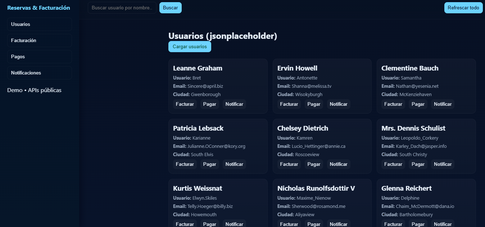

# Trabajo-Microservicios

# Sistema de Reservas y Facturación — Microservicios + APIs Externas

Proyecto académico que implementa un sistema web basado en microservicios, integrando múltiples APIs externas reales, patrones de diseño y un dashboard profesional.

## Tecnologías utilizadas

HTML5 + CSS3 + JavaScript (Vanilla)

Arquitectura basada en microservicios

APIs externas públicas

JSONPlaceholder (usuarios)

FakeStoreAPI (productos/facturación)

POST simulation API (pagos & notificaciones)

Patrones de diseño

Singleton

Módulo

Observador (Observer)

Fachada (Facade)

## Objetivo del proyecto

Diseñar e implementar una solución web basada en microservicios que permita:

Gestionar usuarios

Simular facturación

Simular pagos

Enviar notificaciones

Integrar APIs reales

Mostrar todo en un dashboard moderno

## Arquitectura general del proyecto
   proyecto/
│── index.html
│── styles.css
│── app.js
│── README.md
│
└── (opcional) /docs

El sistema se basa en cuatro microservicios conceptuales:

🔹 Microservicio de Usuarios

Consume la API real:
https://jsonplaceholder.typicode.com/users
Gestiona información del cliente y acciones como:

Ver info

Filtrar usuarios

Inicia acciones de facturación, pagos y notificaciones

🔹 Microservicio de Facturación

API usada:
https://fakestoreapi.com/products
Simula la generación de ítems a facturar usando productos reales.

🔹 Microservicio de Pagos

Simulado con POST real:
https://jsonplaceholder.typicode.com/posts
Permite ejecutar:

Pagos manuales

Pagos asociados a un usuario

Confirmación visual y logs

🔹 Microservicio de Notificaciones

Implementado con:

Observer Pattern

POST simulado a un endpoint real

Sistema de subscripción de listeners

##  Dashboard Profesional

El dashboard incluye:

Sidebar responsiva

Topbar con buscador

Tarjetas (cards) para usuarios

Tablas profesionales para facturación

Logs dinámicos para pagos y notificaciones

Modo oscuro moderno

Tipografía tipo dashboard SaaS

##  Archivos del proyecto
✔ index.html

Interfaz principal, contiene:

Sidebar

Topbar

Paneles dinámicos (usuarios, facturación, pagos, notificaciones)

✔ styles.css

Estilos modernos con:

Gradientes oscuros

Glassmorphism

Componentes visuales adaptados a dashboards SaaS

Responsividad completa

Cards / tables / logs

✔ app.js

Maneja toda la lógica:

Llamadas fetch a APIs reales

Render dinámico

Eventos UI

Observer Pattern

Simulación de pagos

Simulación de notificaciones

Buscador por nombre

##  Patrones de diseño aplicados
###  Singleton (CONFIG global)

Se usa para manejar las URLs de los microservicios desde un solo punto:

const CONFIG = {
  USERS: "...",
  PRODUCTS: "...",
  PAY_ENDPOINT: "..."
};

Evita duplicar rutas → mantenimiento más limpio.

###  Módulo (Funciones encapsuladas)

Ejemplo: renderUsers(), processPayment(), sendNotification()

Cada microservicio está modularizado → mayor escalabilidad.

###  Observer (Notificaciones)

Suscripción de listeners sin acoplamiento:

const listeners = [];
function subscribe(fn){ listeners.push(fn); }
function emit(event, payload){ listeners.forEach(fn => fn(event,payload)); }

Se usa para:

Enviar notificaciones

Registrar pagos exitosos

Mostrar logs

###  Fachada (Facade)

Una sola función simplifica el envío de notificaciones:

async function sendNotification(payload){
  // lógica interna oculta
  return data;
}

Desde la UI solo llamas:

notifyUser(user);

Ocultando detalles internos → código más claro.

##  APIs Externas Integradas
Microservicio	API real	Descripción
Usuarios	jsonplaceholder.typicode.com/users	Lista de usuarios reales simulados
Facturación	fakestoreapi.com/products	Productos para simular ítems facturados
Pagos	jsonplaceholder.typicode.com/posts	Endpoint que recibe POST para simular pagos
Notificaciones	jsonplaceholder.typicode.com/posts	Usado para simular envío de notificaciones
##  Vista previa del dashboard

(Coloca la imagen que generaste usando:)

##  Cómo ejecutar el proyecto
1. Clona el repositorio
git clone https://github.com/tu-usuario/tu-repo.git
cd tu-repo

2. Abre el proyecto

Abre index.html en tu navegador.

No se requiere servidor porque las APIs son públicas.

##  Pruebas rápidas
✔ Cargar usuarios

Botón: "Cargar usuarios"

✔ Facturación

Botón: "Cargar productos"

✔ Pagos

Botón: "Procesar pago"

✔ Notificaciones

Suscribir listener

Emitir notificación
